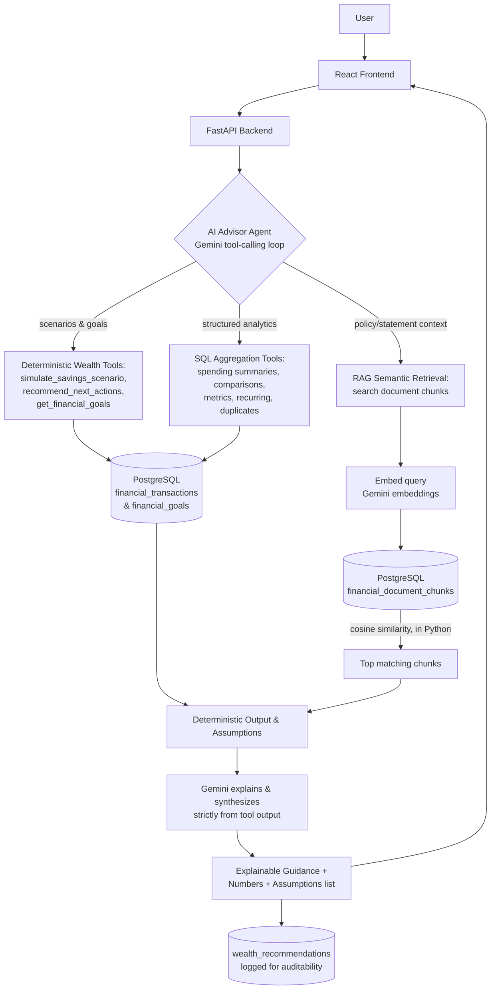

# Wealth Navigator AI

**Personal financial wellness platform — understand your position, explore what-if scenarios, and get proactive, explainable next-best-action recommendations.**

---

## The Problem

Personal financial questions rarely have simple, one-size-fits-all answers. "Can I afford to save ₹10,000 more each month?" requires understanding real net cash flow across debits and credits. "When will I reach my goal?" demands deterministic projections grounded in actual historical spending patterns. "Where can I cut back?" requires detecting subtle month-over-month category surges.

Generic AI chatbots fail at this because they hallucinate projection figures, invent interest or savings rates, and cannot distinguish verified transaction facts from plausible-sounding guesses. In personal finance, a confident but fabricated projection is worse than no advice at all.

## The Solution

**Wealth Navigator AI** decouples mathematical computation and evidence retrieval from AI reasoning. All projections, scenario simulations, category comparisons, and action recommendations are executed by **authoritative, deterministic backend tools** directly against verified PostgreSQL financial records. 

Gemini acts solely as an evidence-grounded advisor: it orchestrates tool selection, synthesizes findings, and translates raw numbers into clear, plain-language guidance—complete with an explicit, visible list of assumptions behind every projection. Gemini never calculates projections or writes SQL itself.

## Why Wealth Navigator AI?

Most financial assistants either provide static dashboards without proactive guidance or conversational bots that guess at numbers.

**Wealth Navigator AI combines deterministic financial modeling with grounded AI advisory:**
- **Deterministic What-If Projections**: Real multi-month cash-flow analysis projects goal timelines without model hallucination.
- **Proactive Next-Best Actions**: Rule-based detection surfaces category spending increases (>15% MoM) and quantifies the exact days/months saved by trimming them.
- **Explicit Assumptions Transparency**: Every recommendation and projection prominently exposes its underlying assumptions (e.g., data window used, balance proxy method, inflation/interest exclusions).
- **Hybrid Document & Transaction Intelligence**: Evaluates structured banking data alongside fee policies, invoices, and bank statements parsed via semantic RAG.
- **Full Traceability & Auditability**: Every scenario simulation and recommendation is logged with inputs, tools called, and outputs.

---

## How It Works



Gemini never receives raw database access or arbitrary arithmetic authority. It selects tools, receives calculated outputs, and explains them. Every figure presented to the user originates from backend code.

---

## What You Can Do

**Goals & What-If Scenarios** — Define financial goals (target amount, date, risk preference). Run interactive what-if simulations adjusting extra monthly savings to project accelerated completion dates and see the exact time saved, with all assumptions made visible.

**Proactive Next-Best Actions** — Receive deterministic, rule-based recommendations that pinpoint spending surges (>15% MoM increase) and calculate how curbing those expenses directly accelerates your financial goals.

**AI Advisor (Financial Copilot)** — Ask natural-language questions regarding your finances, spending habits, and uploaded statements. Receive evidence-grounded answers citing specific transactions and document excerpts without hallucinations.

**Financial Overview** — High-level dashboard showing total transactions, connected accounts, indexed documents, and cash-flow health.

**Document Intelligence** — Upload bank statements, invoices, and fee policies (PDF, CSV, XLSX). Automatically parses structured line items and generates semantic embeddings for RAG retrieval.

**Investigation & Audit Trail** — Built-in operational monitoring and audit logging inherited from the core platform, logging every recommendation run, tool execution, and governed action.

---

## Example

```
"Was this ₹1,999 fee legitimate?"
        ↓
   Financial Copilot Agent
        ↓
 ┌──────────────┬───────────────────┐
 │  SQL lookup   │   Document search  │
 │  (the real    │   (the fee policy, │
 │  transaction) │   embedded chunks) │
 └──────┬────────┴─────────┬─────────┘
        └──────┬────────────┘
               ↓
     Gemini reasons over both
               ↓
"Yes — ₹1,999 late-payment fee on 2026-08-14,
 matching Section 1 of the uploaded fee policy."
        + evidence + sources consulted
```

This is a real, verified output from the running app — not an illustrative mockup.

---

## Current Status

Feature-complete and demo-ready. All five navigated pages (Overview, Data, Investigation,
Financial Copilot, Audit Log) are finished for this phase — this is a portfolio/internship
prototype, not a claimed production financial system, and it runs against Razorpay **Test
Mode** plus a clearly labeled synthetic "Incident Lab" dataset (see "Database tables" further
down for exactly how those are separated).

Known limitations, stated plainly rather than hidden:
- Case-memory "similarity" is a composite score (real cosine similarity plus rule-based
  category/entity/error-code bonuses) over a small seeded set of historical precedents — not a
  large-scale learned similarity model.
- RAG retrieval uses real Gemini embeddings but no vector index (`pgvector` isn't installed on
  the target PostgreSQL) — cosine similarity is computed in Python at query time, which is fine
  at this data scale.
- PDF/CSV/XLSX parsing is best-effort (regex for PDFs, column heuristics for spreadsheets); a
  statement layout that doesn't match yields zero extracted transactions rather than a guess.
- Governed actions execute as a logged, safe simulation — nothing in this codebase ever mutates
  a real Razorpay resource.

---

## Tech Stack

| Layer | Technology | Purpose |
|---|---|---|
| Frontend | React 19, Vite | Single-page dashboard UI |
| Backend | FastAPI, Python | REST API, orchestration |
| Database | PostgreSQL | Single source of truth for all structured and document data |
| DB access | `psycopg2` (raw SQL, no ORM) | Parameterized queries |
| AI reasoning | Google Gemini (`gemini-3.5-flash-lite`), raw REST + function-calling | Reasoning over retrieved evidence |
| Embeddings | Google Gemini (`gemini-embedding-001`) | Semantic vectors for document retrieval |
| Retrieval | In-process cosine similarity (`numpy`) over PostgreSQL-stored vectors | RAG without a dedicated vector DB |
| Document parsing | `pypdf` (PDF), `pandas` / `openpyxl` (CSV/XLSX) | Text and transaction extraction |
| Anomaly detection | `scikit-learn` (IsolationForest) | Unsupervised payment-anomaly scoring |
| File upload | `python-multipart` | FastAPI multipart form handling |
| Testing | `pytest` | Backend test suite (isolated `_test` database, never the real one) |
| Payments integration | Razorpay Test Mode REST API | Real order/payment/refund ingestion |

---

## Running It Locally

1. **Database:** install PostgreSQL, then set `DATABASE_URL` in `.env` (see `.env.example`).
2. **Backend:**
   ```
   cd backend
   pip install -r requirements.txt
   uvicorn app.main:app --host 127.0.0.1 --port 8000 --reload
   ```
   (the schema is created automatically on startup)
3. **Frontend:**
   ```
   cd frontend
   npm install
   npm run dev
   ```
4. **Required environment variables** (see `.env.example`): `DATABASE_URL`, `GEMINI_API_KEY`, `GEMINI_MODEL`. Razorpay credentials are optional — without them the app runs fully on Incident Lab simulation data and user-uploaded financial documents.
5. **Tests:** `cd backend && pytest` — runs against an isolated `<database>_test` database, never the real one.

On Windows, `run_project.ps1` / `run_project.bat` starts PostgreSQL, the backend, and the frontend in one step.

---

## Project Structure

```text
wealth-navigator/
├── backend/
│   ├── app/
│   │   ├── api/routes.py                    # every HTTP endpoint (including /financial/goals and /simulate)
│   │   ├── engine/
│   │   │   ├── financial_copilot_agent.py   # AI Advisor Gemini tool-calling loop + grounding
│   │   │   ├── financial_tools.py           # SQL/retrieval tool registry (scenarios, goals, actions)
│   │   │   ├── document_ingestion.py        # upload -> extract -> chunk -> embed
│   │   │   ├── embeddings.py                # Gemini embedding calls + cosine similarity
│   │   │   ├── gemini_agent.py              # operational investigation's Gemini loop
│   │   │   ├── investigation_tools.py       # operational investigation's tool registry
│   │   │   ├── anomaly_detector.py          # IsolationForest detection
│   │   │   ├── action_governor.py           # human-approval + audit logging
│   │   │   ├── case_memory.py               # historical incident similarity matching
│   │   │   └── database.py                  # schema (init_db) + connection guard
│   │   ├── core/config.py                   # environment-driven settings
│   │   └── main.py                          # FastAPI app entrypoint
│   ├── tests/                                # pytest suite (isolated test database)
│   └── requirements.txt
├── frontend/src/
│   ├── components/ (OverviewView, GoalsView, FinancialCopilotView,
│   │                DataView, InvestigationView, AuditView, Header)
│   ├── api.js                                # all backend API calls
│   └── App.jsx                               # tab navigation + top-level state
├── .env.example
└── run_project.ps1 / run_project.bat
```

---

## Technical Deep Dive

<details>
<summary><strong>RAG architecture — ingestion, retrieval, grounding</strong></summary>

**Ingestion:** upload → detect file type → extract text/table rows → CSV/XLSX use column-heuristic transaction extraction (date, merchant, debit/credit, balance); PDFs use best-effort regex extraction (a non-matching layout yields zero transactions, never invented ones) → deterministic keyword-based category tagging (a backend rule, not a model decision) → section-aware chunking (per-page/paragraph for PDFs, per ~20-row window for spreadsheets) → each chunk embedded and stored → original file bytes stored for preview/download → document marked READY or FAILED with a real reason.

**Retrieval:** this project does **not** use pgvector — it isn't installed on the target PostgreSQL instance. Retrieval instead uses real embeddings from Gemini's embedding model (`gemini-embedding-001`, 3072-dimensions), stored as JSON in a regular PostgreSQL column, ranked by cosine similarity computed in Python at query time. This is genuine embedding-based semantic search, just without a dedicated vector index — a larger deployment would be the natural point to introduce one.

**Grounding:** the retrieval and SQL tools' outputs are the only evidence handed to Gemini for a question. The architecture minimizes hallucination by requiring every financial claim in the final answer to be traced to a specific tool result, and by instructing the model to flag `insufficient_evidence: true` when the tools didn't return enough to answer confidently — this is a prompting and evidence-gathering discipline, not a guarantee that hallucination is impossible.

**Provenance:** every answer carries evidence entries tagged `transaction`, `document`, or `calculation` (with the transaction ID or document filename/page/section behind each one), plus a "sources consulted" list — nothing is listed unless a retrieval call actually returned it.

</details>

<details>
<summary><strong>Gemini's role and tool boundaries</strong></summary>

Gemini is the reasoning layer over evidence that was already retrieved, not a source of financial facts by itself.

| | |
|---|---|
| Reasoning model | `gemini-3.5-flash-lite` (configurable via `GEMINI_MODEL`), raw REST API with function-calling |
| Embedding model | `gemini-embedding-001` |
| Calling pattern | Multi-turn loop: Gemini requests a tool → backend executes it in Python/SQL → result fed back → repeat until a final structured JSON answer |

**Financial & Wealth Tools** (all backend-executed and parameterized — Gemini never writes or sees SQL): `create_financial_goal`, `get_financial_goals`, `simulate_savings_scenario`, `recommend_next_actions`, `search_financial_documents`, `search_financial_policy`, `get_transactions`, `get_transaction_details`, `get_spending_summary`, `compare_periods`, `find_duplicate_transactions`, `find_recurring_transactions`, `calculate_financial_metric` (a whitelisted set of metric names — anything else is rejected before it reaches a query).

**Incident-investigation tools** (separate registry, same pattern): `get_incident`, `get_gateway_metrics`, `get_failed_payments`, `get_affected_merchants`, `get_merchant_metrics`, `get_merchant_refunds`, `get_webhook_activity`, `find_similar_incidents`, and related read-only lookups.

The system prompt and tool design are intended to keep Gemini from: fabricating transactions/documents/policy clauses, inventing scenario projections or interest rates (the backend `simulate_savings_scenario` tool supplies the numbers; Gemini explains them), claiming a charge is fraudulent without a tool-returned basis, computing totals itself, running any SQL or write operation directly, or taking an action without going through the human-approval Action Governor.

</details>

<details>
<summary><strong>Database tables</strong></summary>

**Financial Wellness & Advisory**

| Table | Purpose |
|---|---|
| `financial_accounts` | Logical accounts, derived from an optional account name at upload |
| `financial_goals` | Tracked savings goals (target amount, current amount, target date, risk preference) |
| `wealth_recommendations` | Audit log of scenario simulations & next-best-action runs with explicit assumptions |
| `financial_documents` | One row per upload — filename, type, status, original file bytes, error message if failed |
| `financial_document_chunks` | Chunked text + embedding vector (JSON) + page/section metadata |
| `financial_transactions` | Structured transaction rows extracted from a document |
| `financial_analysis_runs` | One row per AI Advisor question — query, tools called, evidence, response |

**Incident investigation (inherited core platform)**

| Table | Purpose |
|---|---|
| `merchants` / `orders` / `payments` / `refunds` / `webhook_events` | Canonical payment-lifecycle data (real + labeled simulation, source-tagged) |
| `incidents` | Detected anomalies — type, severity, status, evidence |
| `ai_investigations` / `ai_investigation_steps` | Gemini's report and the individual tool calls behind it |
| `incident_embeddings` | Deterministic text-vector embeddings for case-memory matching |
| `governed_actions` / `audit_logs` | Proposed actions and their append-only approval/execution trail |
| `eval_ground_truth` | Labeled scenarios used to benchmark the anomaly detector |

A deleted `financial_documents` row cascades to its chunks and transactions (`ON DELETE CASCADE`) — removing a document can't leave orphaned, still-searchable data behind.

</details>

<details>
<summary><strong>UI navigation and per-question flow</strong></summary>

| Tab | What it does |
|---|---|
| Financial Overview | High-level cash flow, connected accounts, recent activity, system health |
| AI Advisor | Natural-language financial questions, document grounding, explainable advice |
| Goals & Scenarios | Goal tracking, interactive "what-if" savings simulator, proactive next-best actions |
| Data & Documents | Statement uploads, document preview/download, raw data explorer |
| Investigation | Detailed incident investigation with Gemini, case memory, Action Governor |
| Audit Log | Permanent record of all recommendations, simulated actions, and approvals |

**AI Advisor per question:** the question appears immediately as a message, with an assistant placeholder cycling through status text while the tool-calling loop runs; only that placeholder is replaced when the real answer arrives, and every earlier Q&A in the session stays visible. The question and full result are saved to `financial_analysis_runs`; clicking any earlier question in "Recent Investigations" restores the stored answer instantly, without re-running Gemini.

**Goals & Scenario simulation:** adjusting the extra savings slider or months immediately executes deterministic projection math against the account's actual cash-flow history, displaying the projected balance, timeline acceleration, and an explicit breakdown of all assumptions.

</details>
